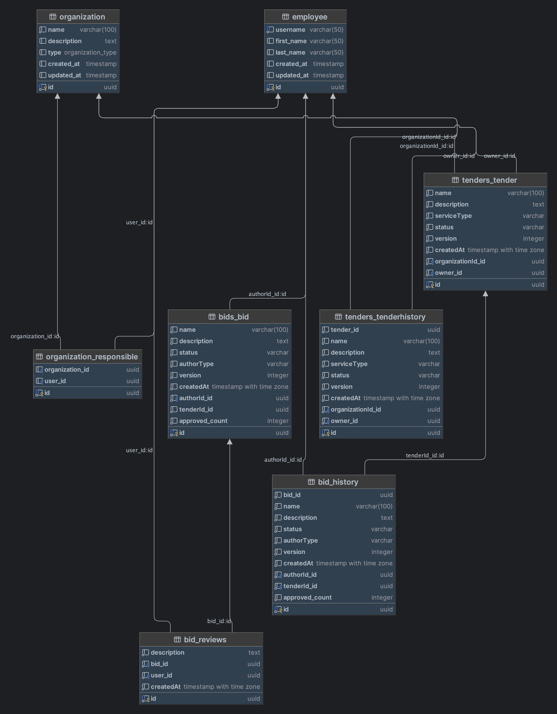

## Структура проекта
В данном проекте применяяется типовая структура проекта на Django Rest Framework:
- модуль `bids` отвечает за модуль "ставок" на предложения
- модуль `tenders` отвечает за модуль размещения и управление предложениями
- модуль `core` используется исключительно для моделей, которые заданы (`employee`, `organization` и `organization_responsible`)
## Задание
В папке "задание" размещена задача.

## Структура БД



## Сбор и развертывание приложения

Для удобства база данных автоматически создается при первом запуске проекта

Для запуска используйте `docker-compose up`, оно сделает абсолютно все :)

Приложение запускается на порту `8080`

## Доступ к сервисам

Организаторами был предоставлен сервер, где можно было развернуть приложение. 

Базовый URL данного API:
```
https://cnrprod1725726830-team-78345-32801.avito2024.codenrock.com
```

